# 🏥 Medic Sewa

### *Transforming Healthcare Through Technology*

[About](#-about) • [Features](#-features) • [Projects](#-our-projects) • [Tech Stack](#-tech-stack) • [Contributing](#-contributing)

---

## 🌟 About

**Medic Sewa** is dedicated to revolutionizing healthcare delivery through innovative technology solutions. We build intelligent, user-friendly applications that bridge the gap between healthcare providers and patients, making quality healthcare accessible to everyone.

Our mission is to leverage cutting-edge AI and modern software engineering practices to create seamless healthcare experiences that save time, reduce costs, and improve patient outcomes.

---

## ✨ Features

<table>
<tr>
<td width="50%">

### 🏥 Hospital & Clinic Management
- **Complete EHR/EMR System**
- Patient registration & records
- Appointment scheduling
- Billing & insurance management
- Inventory & pharmacy tracking
- Lab results integration

</td>
<td width="50%">

### 🤖 AI-Powered Intelligence
- **Smart Medical Assistant**
- Clinical note summarization
- Diagnosis support & recommendations
- Drug interaction warnings
- Treatment plan suggestions
- Natural language queries

</td>
</tr>
<tr>
<td width="50%">

### 📅 Advanced Appointment System
- **Seamless Scheduling**
- Real-time availability
- Multi-provider calendars
- Automated reminders (SMS/Email)
- Telemedicine integration
- Queue management

</td>
<td width="50%">

### 📊 Analytics & Insights
- **Data-Driven Decisions**
- Patient flow analytics
- Revenue tracking
- Performance metrics
- Predictive modeling
- Custom reporting

</td>
</tr>
</table>

---

## 🚀 Our Projects

| Project | Description | Status |
|---------|-------------|--------|
| **🏥 MedicCore** | Comprehensive hospital management system with EHR, billing, and inventory | 🟢 Active |
| **🤖 AI-Clinician** | AI-powered clinical decision support and note summarization | 🟡 In Development |
| **📱 PatientPortal** | Mobile-first patient engagement and telemedicine platform | 🟢 Active |
| **📅 SmartScheduler** | Intelligent appointment scheduling with AI optimization | 🟡 In Development |
| **🔬 LabConnect** | Laboratory information system integration platform | 🔵 Planning |
| **💊 PharmacyHub** | Prescription management and drug interaction checker | 🟢 Active |

---

## 🛠️ Tech Stack

### Frontend

### Backend

### AI & ML

### Infrastructure

---

## 🎯 Key Highlights

```mermaid
graph LR
    A[👥 Patients] --> B[📱 Patient Portal]
    C[👨‍⚕️ Doctors] --> D[🏥 MedicCore]
    D --> E[🤖 AI Assistant]
    E --> F[📊 Clinical Insights]
    B --> G[📅 Appointments]
    G --> D
    D --> H[💊 Pharmacy]
    D --> I[🔬 Laboratory]
    F --> C
```

---

## 🌍 Impact

| Metric | Value |
|--------|-------|
| **Healthcare Facilities** | 500+ |
| **Active Patients** | 100,000+ |
| **Appointments Processed** | 1M+ |
| **AI Summaries Generated** | 250,000+ |
| **Hours Saved** | 50,000+ |

---

## 🤝 Contributing

We welcome contributions from developers, healthcare professionals, and enthusiasts! Here's how you can help:

1. **🍴 Fork** the repository
2. **🔨 Create** your feature branch (`git checkout -b feature/AmazingFeature`)
3. **✅ Commit** your changes (`git commit -m 'Add some AmazingFeature'`)
4. **📤 Push** to the branch (`git push origin feature/AmazingFeature`)
5. **🎉 Open** a Pull Request

Please read our [Contributing Guidelines](CONTRIBUTING.md) and [Code of Conduct](CODE_OF_CONDUCT.md) before contributing.

---

## 📋 Requirements & Standards

- ✅ **HIPAA Compliant** - All applications meet healthcare privacy standards
- 🔒 **Security First** - End-to-end encryption, secure authentication
- ♿ **Accessible** - WCAG 2.1 AA compliance for all user interfaces
- 🌐 **Multilingual** - Support for multiple languages and locales
- 📱 **Mobile Ready** - Responsive design for all devices

---

## 📬 Contact & Support

---

## 📄 License

This project is licensed under the MIT License - see the [LICENSE](LICENSE) file for details.

---

### 💙 Built with passion for better healthcare

**Medic Sewa** • *Serving Health, Serving Humanity*

⭐ Star our repositories if you find them helpful!

